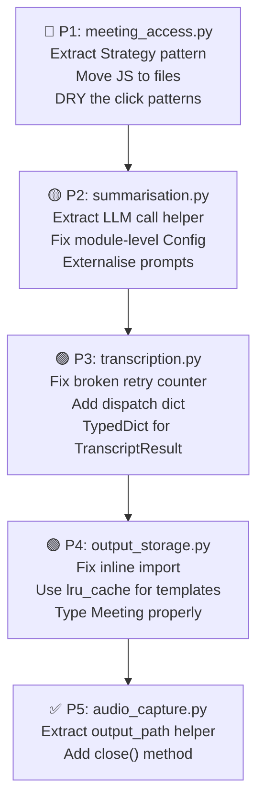

# 🧹 Clean Code Review — Backend Modules

> [!NOTE]
> This is an analysis-only review. **No code has been changed.** Each finding explains **what** needs cleaning and **why**, so you can decide what to prioritise.

---

## Module-by-Module Findings

### 1. `audio_capture.py` (217 lines) ✅ Cleanest Module

**Verdict:** This is your best module. Well-structured, good docstrings, clear error handling. Only minor tweaks needed.

| # | Issue | Type | What to do |
|---|-------|------|------------|
| 1 | **Output-path extraction is over-defensive** (L177-190) | Complexity | The 4-layer `getattr` / `vars()` chain for `output_path` is hard to read. Extract into a small helper method like `_extract_output_path(response)` |
| 2 | **No `close()` / context-manager support** | Resource leak | The `obs.ReqClient` connection is never explicitly closed. Add `__enter__`/`__exit__` or a `close()` method |
| 3 | **`_recordings_dir` is created but never used** (L69, L76) | Dead reference | The dir is `makedirs`'d but the actual output path comes from OBS. Either remove or use it to validate the OBS output |

---

### 2. `meeting_access.py` (1,308 lines) 🔴 Needs Major Refactoring

**Verdict:** This is a **God Class**. A single class handling 4 platforms × 4 responsibilities (join, wait, detect-end, leave) with massive inline JS. This is the #1 priority for cleanup.

| # | Issue | Type | What to do |
|---|-------|------|------------|
| 1 | **God Class — 1,308 lines in one class** | SRP violation | Extract each platform into its own strategy class (e.g., `GoogleMeetStrategy`, `ZoomStrategy`, `TeamsStrategy`, `ZoomSdkStrategy`). `MeetingAccess` becomes a thin router that delegates to the correct strategy |
| 2 | **Massive inline JavaScript strings** (L540-563, L696-706, L748-766, L804-830, L868-884, L925-936, L1150-1203) | Readability / Maintainability | Move each JS snippet into separate `.js` files under a `js/` folder and load them with `Path.read_text()`. This lets you syntax-highlight, lint, and test them independently |
| 3 | **Duplicated "multi-strategy click" pattern** | DRY violation | The loop pattern `for by, selector in [...]: try: click; break; except: continue` appears **8+ times** (join buttons, name fields, mic toggles, camera toggles, leave buttons). Extract a `_try_click_strategies(strategies, timeout)` → `bool` helper |
| 4 | **Duplicated "enter name via JS React setter" pattern** | DRY violation | The React `Object.getOwnPropertyDescriptor(...).set` trick appears in both `_join_zoom` (L556-561) and `_join_teams` (L875-881). Extract to a shared `_react_set_input_value(selector, value)` method |
| 5 | **`_ALONE_PATTERNS` and `_LOBBY_PHRASES` redefined in multiple methods** | DRY violation | `_LOBBY_PHRASES` is defined in both `wait_until_end` (L144-150) and `_is_alone_in_meeting` (L1101-1106). `_ALONE_PATTERNS` is defined inline in `_is_alone_in_meeting` (L1117-1133). Move them to **module-level constants** |
| 6 | **`_TEAMS_END_PHRASES` defined inside a method** (L1029-1036) | DRY | Should be a module-level constant, alongside `_LOBBY_PHRASES` |
| 7 | **`import urllib.parse` inside method body** (L342, L376) | Style | Move to the top of the file with other imports |
| 8 | **No type hints on `self.selectors`** | Type safety | Define a `TypedDict` or at minimum annotate as `dict[str, dict[str, str]]` |
| 9 | **`_detect_platform` returns magic strings** | Type safety | Replace raw strings (`"google_meet"`, `"zoom"`, etc.) with a `Platform` enum. This prevents typos and gives IDE autocompletion |
| 10 | **`wait_until_end` is 160+ lines** | Method too long | Split into `_wait_teams_lobby()` and `_poll_meeting_end()` |
| 11 | **`_meeting_has_ended` uses platform `if/elif` chain** | OCP violation | With the Strategy pattern (item #1), each strategy would have its own `has_ended()` method |
| 12 | **Hardcoded `"AI Summarizer"` bot name** (L533, L666) | Magic string | Extract to a class constant `BOT_NAME = "AI Summarizer"` or read from config |
| 13 | **`_safe_click` silently swallows all failures** | Debuggability | Add a `logger.debug()` on the except branch so you know which selectors were tried |
| 14 | **No resource cleanup if `__init__` partially succeeds** | Robustness | If `selectors.json` loads but Chrome crashes, the partially-constructed object leaks. Use a factory method or `__enter__`/`__exit__` |

---

### 3. `summarisation.py` (533 lines) 🟡 Moderate Issues

**Verdict:** Good structure overall, but the LLM call pattern is duplicated and the prompts are embedded as long strings.

| # | Issue | Type | What to do |
|---|-------|------|------------|
| 1 | **Module-level `_cfg = Config()`** (L61) | Testability | This runs at import time, making it impossible to inject a test config. Pass `Config` through `__init__` only (you already accept `model` and `temperature` — just add `config` too) |
| 2 | **Duplicated LLM call pattern (try JSON mode → fallback)** | DRY violation | The try-`json_object`-except-`BadRequestError`-retry pattern is copy-pasted between `_generate_summary` (L269-293) and `_detect_speakers_from_text` (L389-412). Extract a `_call_llm(system_prompt, user_prompt, temperature)` helper |
| 3 | **Long prompt strings inline** | Readability | The system prompts at L238-252 and L351-378 are 15+ line string concatenations. Move them to a `prompts/` folder as `.txt` or `.jinja2` files, or at least define them as module-level constants |
| 4 | **`_analyse_participation` is a free function** | Encapsulation | It logically belongs to the `Summarisation` class (or a dedicated `SpeakerAnalytics` class). Being module-level means it's importable by anyone, which is fragile |
| 5 | **No retry logic for transient LLM failures** | Robustness | HTTP 500 from the LLM provider raises `LLMAPIError` immediately. Consider adding a retry with exponential backoff (the Transcription module already does this well) |
| 6 | **`generate_report` does two LLM calls silently** | Transparency | The method makes 1 summary call + 1 speaker-detection call, but the caller has no idea. Document the cost implications or provide a `skip_speaker_detection` flag |
| 7 | **`detection_method` is injected via string mutation** (L504, L516) | Fragility | Adding keys to dicts after creation is error-prone. Include it in `_analyse_participation()` as a parameter or return a dataclass |

---

### 4. `transcription.py` (555 lines) 🟢 Good, Minor Issues

**Verdict:** Solid strategy/router pattern. Well-documented error taxonomy. A few cleanups needed.

| # | Issue | Type | What to do |
|---|-------|------|------------|
| 1 | **`Config()` instantiated inside `__init__`** (L105) | Testability | Accept an optional `config: Config | None = None` parameter (same pattern as `AudioCapture`) |
| 2 | **`_dispatch` uses an if/elif chain** | OCP violation | Use a dispatch dict: `{"whisper": self._transcribe_whisper, ...}` — same pattern you already use in `MeetingAccess.join()` |
| 3 | **`attempt = 0` reassignment inside for-loop** (L186) | Bug | `for attempt in range(...)` rebinds `attempt` on each iteration. Setting `attempt = 0` inside the loop body has **no effect** on the next iteration. This "reset counter" logic is broken |
| 4 | **Whisper client created per-call** (L247) | Performance | `openai.OpenAI()` is constructed on every `_transcribe_whisper` invocation. Create it once in `__init__` |
| 5 | **`_normalise` duplicates the if/elif dispatch** | DRY | Same pattern as `_dispatch` — use a dict mapping |
| 6 | **Deepgram word-grouping logic is dense** (L486-516) | Readability | The speaker-segment grouping loop is 30 lines of index manipulation. Extract to a `_group_words_by_speaker(words)` helper with its own docstring and unit test |
| 7 | **`_MAX_AUDIO_BYTES` values use comments for units** | Clarity | Use named constants: `_25_MB = 25 * 1024 * 1024` or document more clearly |
| 8 | **`TranscriptResult` is just a `dict` alias** (L73) | Type safety | Replace with a `TypedDict` or Pydantic model (you already use Pydantic in `summarisation.py`) |

---

### 5. `output_storage.py` (455 lines) 🟢 Good, Minor Issues

**Verdict:** Clean async design. Template system is well-structured. A few architectural concerns.

| # | Issue | Type | What to do |
|---|-------|------|------------|
| 1 | **Global mutable state for template caching** (L71-72) | Thread safety | `_EMAIL_TEMPLATE` and `_PARTIAL_CACHE` are module-level mutables. In a multi-worker deployment, the first-write race is benign (same content), but it's still a code smell. Use `functools.lru_cache` on the loader functions |
| 2 | **Inline import inside method** (L199) | Style | `from src.models.meeting import MeetingStatus` is imported inside `_store_to_database`. Move to the top of the file or at least to module level to avoid circular import masking |
| 3 | **`_VALID_BACKENDS` only has one entry** (L103) | YAGNI | `frozenset({"database"})` with a full validation pathway is over-engineered for a single valid value. Either simplify or document that more backends are planned |
| 4 | **`send_email` re-renders the HTML body per recipient** | Performance | `_format_email_body` is called once, but a new `MIMEMultipart` is built per recipient. The body render is already outside the loop (good!), but the method signature suggests it could be called separately — consider making `_format_email_body` a `@staticmethod` or extracting email building entirely |
| 5 | **`meeting: Any` type hint** (L166, L406) | Type safety | Use the actual Beanie `Meeting` type (with `TYPE_CHECKING` import to avoid circular deps) |
| 6 | **`store()` only calls one method** (L446) | Over-abstraction | The routing dispatcher pattern (`if backend == "database"`) exists for a single backend. Either simplify or document future backends |

---

## Cross-Cutting Concerns (All Modules)

These issues appear across **multiple or all** modules:

| # | Issue | Modules Affected | What to do |
|---|-------|-----------------|------------|
| 1 | **No `__all__` exports** | All 5 | Add `__all__` to each module to make the public API explicit |
| 2 | **`Config()` instantiation inconsistency** | All 5 | `audio_capture` accepts optional config, `summarisation` uses module-level, `transcription` creates internally, `output_storage` accepts optional config. **Pick one pattern and use it everywhere** — recommended: optional `config` parameter in `__init__` |
| 3 | **No abstract base class / interface** | All 5 | Each module is a pipeline stage. Define a `PipelineStage` ABC with `run()`, `healthcheck()`, `close()` methods. This enables uniform orchestration and testing |
| 4 | **Inconsistent logging prefixes** | All 5 | `audio_capture` has no prefix, `summarisation` uses `[SM]`, `output_storage` uses `[OS]`, `transcription` uses `[ST]` sometimes. Standardise on a prefix convention like `[AC]`, `[MA]`, `[TR]`, `[SM]`, `[OS]` |
| 5 | **No `close()` / cleanup protocol** | `audio_capture`, `meeting_access`, `transcription` | These hold external connections (OBS WebSocket, Chrome WebDriver, OpenAI client). Implement context manager (`__enter__`/`__exit__`) for safe cleanup |
| 6 | **Broad `except Exception` catches** | `meeting_access` (9 times), `summarisation` (1), `transcription` (2) | Many `except Exception` blocks mask bugs. Narrow them to the specific exception types expected |
| 7 | **Missing return type hints on some private methods** | `meeting_access` | Several private methods lack return type annotations |
| 8 | **No docstrings on some private methods** | `meeting_access` | `_build_chrome_options`, `_teams_web_url`, `_zoom_web_client_url` have docstrings, but some inner helper logic does not |

---

## Priority Ranking

## Summary

| Module | Lines | Severity | Top Issue |
|--------|-------|----------|-----------|
| `meeting_access.py` | 1,308 | 🔴 High | God Class — needs Strategy pattern extraction |
| `summarisation.py` | 533 | 🟡 Medium | Duplicated LLM call pattern, module-level Config |
| `transcription.py` | 555 | 🟢 Low | Broken retry counter reset (actual bug!) |
| `output_storage.py` | 455 | 🟢 Low | Inline import, template caching style |
| `audio_capture.py` | 217 | ✅ Minimal | Already clean, minor polish only |

> [!IMPORTANT]
> The **broken retry counter** in `transcription.py` (line 186: `attempt = 0`) is the only finding that is an **actual runtime bug**, not just a style issue. The `for attempt in range(...)` rebinds `attempt` on each loop iteration, so the reset has no effect. This means the fallback provider never gets a fresh set of retries.

Would you like me to implement any of these improvements?
